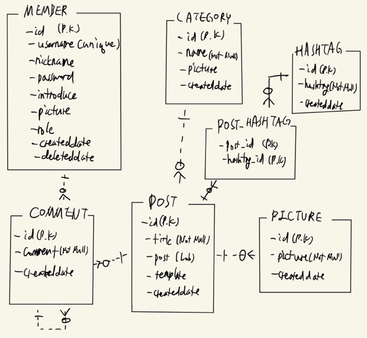

# Jangtari_blog
## -- 리팩토링 진행중 --

개인 블로그 프로젝트  
주소 : https://www.gamsk.kro.kr (세부사항 설정 중)

## 1. 동기 및 개발 목표

- 사진과 함께 글을 적을 수 있는 블로그를 갖길 원하는 친구의 부탁으로 개인 블로그를 제작하는 프로젝트를 시작하게 되었다.
- 백엔드 공부를 하면서 가장 많이 만들어본 토이 프로젝트가 바로 블로그 프로젝트였기 때문에 DB 설계 및 전체적인 서비스 로직 설계에 있어서 익숙함이 있었다.
- (스프링부트 + Thymeleaf의 Spring MVC 기반 블로그 프로젝트 : <https://github.com/jrucl2d/Start_Spring_Boot>)
- (스프링부트 + jsp의 Spring MVC 기반 블로그 프로젝트 : <https://github.com/jrucl2d/SpringBoot_Blog>)
- (nodejs + nunjucks 템플릿 엔진 기반 블로그 프로젝트 : <https://github.com/jrucl2d/ggbook_production>)
- (jsp + Java bean + 오라클 JDBC를 사용한 SNS 프로젝트 : <https://github.com/jrucl2d/2020-2-Database-Programming-SNS-Service>)
- DB 설계부터 모든 기능 구현, 배포까지 혼자서 진행해본 경험이 없었기 때문에 도전하는 마음으로 프로젝트를 시작하게 되었다.
- 최종적인 목표는 계획한 기능을 모두 구현하고 클라우드에 배포해서 실사용 가능하도록 하는 것이다.

## 2. 기술 스택

### 2.1 프론트엔드

- React.js
- Redux
- Bootstrap

### 2.2 백엔드

- SpringBoot
- Spring Data JPA
- QueryDsl
- Spring Security : JWT 로그인 구현, 토큰은 쿠키에 저장
- Google Drive API : 이미지 저장소로 사용
- Mysql
- Redis : JWT 로그인 관련

## 3. DB 설계

## 4. 주요 기능 소개

### 4.1 로그인(JWT 로그인)

- 세션-쿠키 기반의 기존 Spring Security의 로그인 방식이 아닌 JWT 토큰 방식의 로그인을 구현했다.
- 유효기간이 짧은(2분) Access Token과 유효기간이 긴 Refresh Token을 쿠키에 저장한다.
- Access Token의 payload에서 읽어온 username 정보를 바탕으로 인증 객체를 생성해 로그인 처리한다.
- Access Token이 만료되었을 시 Refresh Token으로부터 username을 가져온 뒤 redis 저장소에 [Refresh Token - username]의 key-value 형식으로 저장된 username과 비교하여 검증을 시도한다.
- 검증되었다면 새로운 Access Token을 발급해주고 인증 객체를 생성해 로그인 처리한다.
- 로그아웃은 쿠키에서 Access Token 쿠키의 유효 기간을 0으로 설정해 삭제하고 redis 저장소에서 refresh token을 키로 갖는 username을 삭제해 로그아웃 처리한다.
- [참고 문헌]
- [https://webfirewood.tistory.com/115](https://webfirewood.tistory.com/115)
- [https://velog.io/@dsunni/Spring-Boot-React-JWT로-간단한-로그인-구현하기](https://velog.io/@dsunni/Spring-Boot-React-JWT%EB%A1%9C-%EA%B0%84%EB%8B%A8%ED%95%9C-%EB%A1%9C%EA%B7%B8%EC%9D%B8-%EA%B5%AC%ED%98%84%ED%95%98%EA%B8%B0)
- [https://velog.io/@ehdrms2034/Spring-Boot-Security-JWT-JPAMysql를-이용한-Restful-Login-사용하기-1](https://velog.io/@ehdrms2034/Spring-Boot-Security-JWT-JPAMysql%EB%A5%BC-%EC%9D%B4%EC%9A%A9%ED%95%9C-Restful-Login-%EC%82%AC%EC%9A%A9%ED%95%98%EA%B8%B0-1)

### 4.2 Google Drive API 사용

- 업로드하는 사진을 저장하는 저장소로 클라우드의 스토리지 서비스를 사용할 수도 있지만 API를 사용하는 경험을 쌓기 위해 Google Drive API를 적용했고, 업로드 하는 사진은 Google Drive에 저장된다.
- 미리 Google Drive API를 사용하는 프로젝트를 생성해 두었고, Oauth 인증이 가능한 클라이언트 ID와 비밀번호를 발급받아 json 파일로 저장해 프로젝트에 추가했다.
- 최초에 Oauth 요청을 보내 웹 어플리케이션이 사용자 Google Drive의 정보에 접근하는 것을 동의받고, authorization code를 전달 받는다.
- 전달받은 authorization code를 통해 Access Token을 발급받고 해당 Access Token을 credential 파일로 저장한다.
- 이후부터는 저장한 credential 파일을 통해 Google Drive에 접근해 사진을 업로드할 수 있게 된다.
- [참고 문헌]
- https://opentutorials.org/course/3405
- https://developers.google.com/drive/api/v3/about-sdk
- https://www.youtube.com/playlist?list=PL6staZz89fj_sEJkcwATwSjKTENIkMCAl

### 4.3 클라우드 배포

- 오라클 클라우드의 항상무료 서비스를 이용해 VM을 생성하고 완성한 서버를 배포했다.
- 오라클 클라우드 계정 생성 및 각종 설정 처리는 아래의 블로그의 도움을 받았다.
- https://kibua20.tistory.com/121
- 오라클 클라우드에서 제공하는 고정 IP를 발급받아 설정하고 아래 사이트에서 무료 도메인을 등록했다.
- https://xn--220b31d95hq8o.xn--3e0b707e/

### 4.4 nginx

- nginx를 사용해 포트 포워딩을 구현했다.
- forward-proxy : 클라이언트의 요청을 forward-proxy 서버가 대신 받아서 목적지에 요청하고 응답을 받는다.
- reverse-proxy : 클라이언트가 웹 서비스의 데이터를 요청하면 reverse-proxy 서버가 이 요청을 대신 받아서 내부 서버로부터 데이터를 받은 후 클라이언트에게 전달해준다.
- nginx를 reverse-proxy서버로 사용하면서 포트 포워딩(nginx 포트 번호 80 -> 톰켓 서버 포트 번호 8080)을 구현하였다.
- nginx가 요청을 받아서 여러 웹서버에게 요청을 분산 처리해주는 로드 밸런싱은 프로젝트의 규모가 작기 때문에 적용하지 않았다.
- 후에 서비스를 업데이트하고 새로운 버전을 서버에 올릴 때 nginx의 포트 포워딩 포트 번호를 변경하고 nginx Reload를 함으로써 무중단 배포가 가능하다.
- [참고 문헌]
- https://github.com/jojoldu/springboot-webservice
- https://jackerlab.com/nginx-info-install-in-centos8/

### 4.5 HTTPS 적용

- 무료 오픈소스 SSL인 Let's Encrypt을 적용했다.
- 복잡한 과정을 거칠 것 없이 nginx와 certbot을 사용하면 매우 손쉽게 https를 적용할 수 있다.
- [참고 문헌]
- https://hotheadfactory.com/?p=2081

### 4.6 서버 구동

- java -jar \*.jar로 구동할 수 있지만 터미널을 종료해도 영구히 실행시키기 위해서는 nohup 명령어를 사용해야 한다.
- 아래 블로그를 참고해 nohup 명령어로 서버를 구동시켰다.
- [참고 문헌]
- https://in-idea.tistory.com/30

## 5. TODO LIST

### 5.1 공통 기능

- [x] 회원가입
- [x] 로그인
- [x] 로그아웃
- [x] 회원 정보 변경(닉네임, 비밀번호 변경 가능)
- [x] 댓글 추가
- [x] 대댓글 추가(1계층 대댓글까지만 가능)
- [x] 댓글 수정(본인의 경우에만)
- [x] 댓글 삭제(본인의 경우에만)
- [x] 제목, 내용, 해시태그로 게시글 검색
- [ ] 회원 탈퇴

### 5.2 장성균 전용 기능

- [x] 개인 소개 변경(닉네임, 소개글, 사진)
- [x] 카테고리 추가 / 리팩토링 [x]
- [x] 카테고리 정보 변경(카테고리 제목, 사진 변경 가능) / 리팩토링 [x]
- [x] 카테고리 삭제 / 리팩토링 [] -> 카테고리 삭제시 게시글 등 연관된 정보 삭제 구현
- [x] 게시글 템플릿 선택(현재 두 개)
- [x] 게시글 작성(제목, 해시태그 최대 5개, 본문, 사진) / 리팩토링 [x]
- [x] 게시글 수정(제목, 본문, 템플릿, 해시태그, 사진 변경 가능)
- [x] 게시글 삭제

### 5.3 내부 기능

- [x] 페이징 처리
- [x] JWT 로그인 구현
  - [x] Spring Security 설정파일에 jwt 사용하도록 configure 메소드 설정
  - [x] JWT 토큰 발급 관련 클래스 구현(JWTTokenProvider)
  - [x] JWT 인증 관련 filter 클래스 구현(JWTAuthenticationFilter)
- [x] Google Drive API 연동
  - [x] Google API 프로젝트 생성
  - [x] 사진 저장 관련 로직에 Google Drive API 추가
- [x] 배포할 클라우드 환경 세팅 : 오라클 클라우드
- [x] 도메인 설정 : 무료 도메인
- [x] nginx를 사용한 포트 포워딩 : 80(HTTP) -> 8080(톰켓 서버 포트)
- [x] HTTPS 적용
